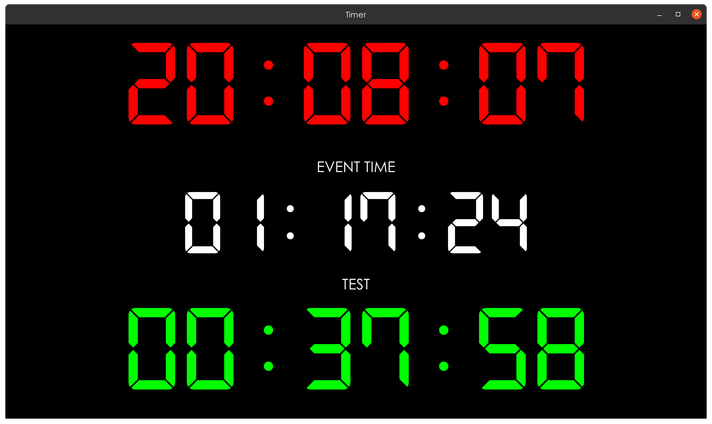

# Timer application for CasparCG.

The timer application is intended to be used in conjunction with
[CasparCG](https://github.com/CasparCG) Server and/or Client. It uses
[OSC](http://opensoundcontrol.org/spec-1_0) protocol to display event running
time as well as current video countdown.



Other than the video countdown, the app *can* also be used by itself with a
touchscreen or mouse:

* Tapping on the event running time (not the text, but the actual time) will
start, pause or resume the count.
* The event time can be adjusted by tapping at the top or bottom of the hours,
minutes and seconds.
* Pressing and holding on the event time will reset it to zero.
* The clock time can likewise be adjusted by tapping at the top or bottom of the
hours, minutes and seconds.
* Pressing and holding on the clock time will reset the adjustments.

---

Following options that can be used to customize appearance and operation of the
app:

```
--full-screen      Show application in full screen.

--port=<n>         Set UDP port to listen on.
                   Default: 7250

--channel=<...>    Set channel to be monitored. Default: 1

--layer=<...>      Set one or more layers to be monitored. Layers can be
                   specified as several comma-separated values and/or ranges.
                   Negative numbers are removed from the set.
                   This option can be repeated multiple times.
                   Example: --layer=1-5,10 --layer=20,-3 (= 1,2,4,5,10,20).
                   Default: 10

--name-size=<pt>   Set font size for the event and video names.
                   Default: 20

--clock-size=<pt>  Set font size for the clock widget.
                   Default: 160

--event-size=<pt>  Set font size for the event widget.
                   Default: 120

--video-size=<pt>  Set font size for the video widget.
                   Default: 160

-h, --help         Displays this help.
```

---

To integrate the app with the CasparCG Server, add the following lines to
`casparcg.config`:

```xml
<osc>
  <predefined-clients>
    <predefined-client>
      <address>192.168.1.123</address>
      <port>7250</port>
    </predefined-client>
  </predefined-clients>
</osc>
```

Change the IP address to the host running the timer app.

When you play videos, the app will show name and countdown for the top active
layer video (taking into account the `--channel` and `--layer` options).

---

Event running time can also be triggered from the CasparCG Client.

First, go to the `Settings` menu, select the `OSC` tab and click on `+` (the
plus sign) below the `OSC Output` section. Enter the IP address and port of the
host running the timer app.

To trigger event start, stop, pause, resume or reset from the rundown, do this:

* Add `OSC Output` item to the rundown.
* Select OSC output (which you have added above) from the `Output` drop-down.
* In the `Path` field enter `/event/state`.
* In the `Message` field enter one of `start`, `pause`, `resume`, `stop` or
  `reset` and select `String` as the `Type`.

Share and enjoy.

## Installation

### Prerequisites

* [libosc++](https://github.com/dimitry-ishenko-casparcg/liboscpp) >= 0.8

Follow installation instructions on their home page. `libosc++-dev` package is
only needed when compiling timer from source.

### Binary

Debian/Ubuntu/etc:

```console
$ ver=0.7
$ url=https://github.com/dimitry-ishenko-casparcg/timer/releases/download/v${ver}
$ wget ${url}/timer_${ver}_amd64.deb
$ sudo apt install ./timer_${ver}_amd64.deb
```

RaspberryPi:

```console
$ ver=0.7
$ url=https://github.com/dimitry-ishenko-casparcg/timer/releases/download/v${ver}
$ wget ${url}/timer_${ver}_armhf.deb
$ sudo apt install ./timer_${ver}_armhf.deb
```

### From source

Stable version (requires [Qt](https://www.qt.io/) >= 5.7 and
[CMake](https://cmake.org/) >= 3.1):

```console
$ ver=0.7
$ wget https://github.com/dimitry-ishenko-casparcg/timer/archive/v${ver}.tar.gz
$ tar xzf v${ver}.tar.gz
$ mkdir timer-${ver}/build
$ cd timer-${ver}/build
$ cmake ..
$ make
$ sudo make install
```

Latest master (requires [git](https://git-scm.com/), [Qt](https://www.qt.io/) >=
5.7 and [CMake](https://cmake.org/) >= 3.1):

```console
$ git clone https://github.com/dimitry-ishenko-casparcg/timer.git
$ mkdir timer/build
$ cd timer/build
$ cmake ..
$ make
$ sudo make install
```

## Authors

* **Dimitry Ishenko** - dimitry (dot) ishenko (at) (gee) mail (dot) com

## License

This project is distributed under the GNU GPL license. See the
[LICENSE.md](LICENSE.md) file for details.
